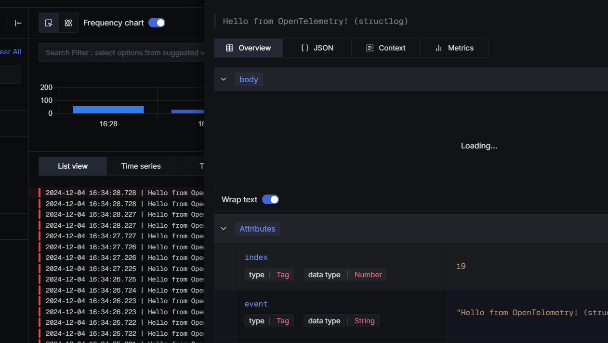
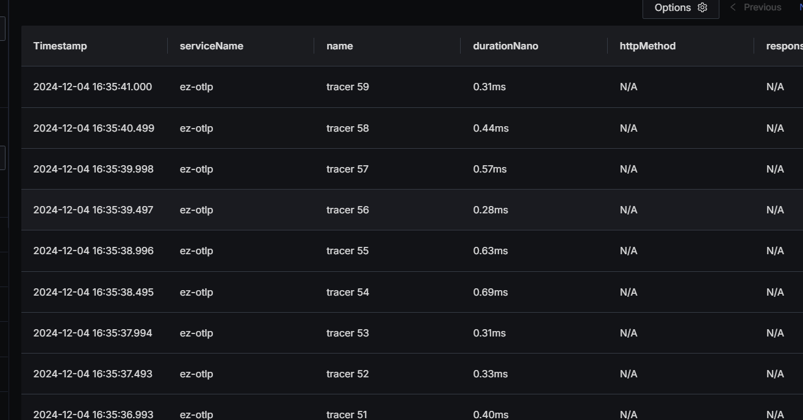
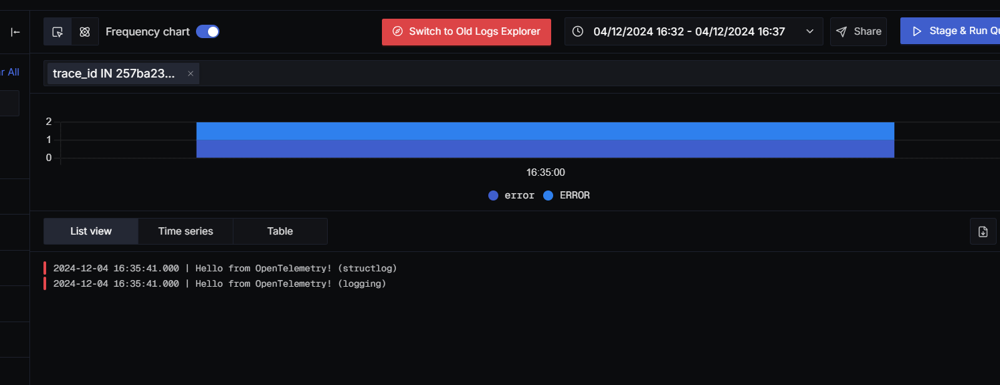

# ez-otlp

> ez-otlp 是一个简单的工具，无需复杂的配置，即可便捷的使用现代化的监控系统，帮助开发者简化遥测数据的采集和传输，非常适用于现代云原生应用和微服务架构的服务中
> 通过 OpenTelemetry 高效收集如日志、指标、跟踪，可以与现有的监控工具和平台（如 Prometheus、Grafana、Datadog 等）无缝集成

🚀 快速实现 应用程序性能监控、日志管理、分布式跟踪、指标和仪表板、警报

🛠️ 通过环境变量解决99%的参数设置，开箱即用，无需繁琐的参数就可以与 OpenTelemetry 无缝集成。

❤️ demo 采用 SigNoz，直观的界面体验现代化监控系统带来的拜尼马

### 文档
<a href="https://github.com/a1403951401/ez_otlp/blob/main/README.md">English</a> &bull;
<a href="https://github.com/a1403951401/ez_otlp/blob/main/README.zh-cn.md">中文</a>

### 安装
> pip install ez-otlp

### 使用说明
##### 项目中使用
```python
# env
# EZ_ENDPOINT = http://host.docker.internal:4317/v1/traces
# EZ_RESOURCE_SERVICE_NAME = ez-otlp

from ez_otlp import EZ_OTLP

otlp = EZ_OTLP(log=["logging", "structlog"])
```
##### 运行 template.py
```bash
docker-compose up
```

#### 启用本地托管的 SigNoz
> http://localhost:3301/
```bash
cd signoz
docker-compose up -d
```

### 图片





### Todolist
 - 日志模块支持 -> loguru
 - 与其他服务集成 -> Litestar, FastAPI, Starlette, Aiohttp, sqlalchemy, redis
 - 完善文档
